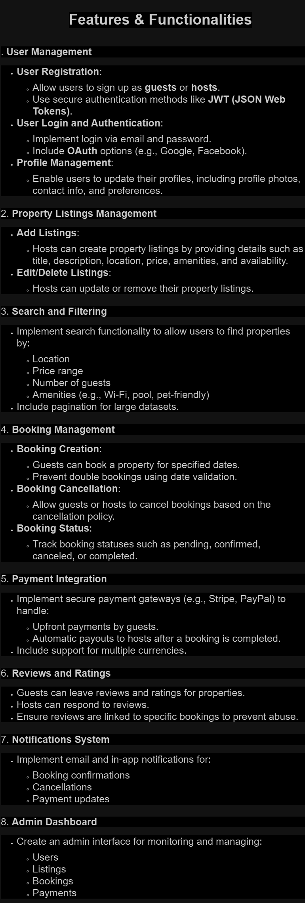

# Airbnb Clone Backend Features and Functionalities

This document outlines the core features and functionalities required for the backend of the Airbnb Clone project.

## Features Overview

The backend of the Airbnb Clone will support the following key functionalities:

### 1. **User Authentication**
   - User Registration (Guests and Hosts)
   - Login and Logout
   - JWT-based authentication
   - User roles and permissions (Guest/Host/Admin)

### 2. **Property Management**
   - Create, update, and delete property listings
   - Upload property images
   - Define property amenities
   - Set pricing and availability
   - Search and filter properties by location, price, and amenities

### 3. **Booking System**
   - Property booking by guests
   - View booking details
   - Cancel bookings
   - Manage booking status (pending, confirmed, canceled)

### 4. **Payments**
   - Integration with third-party payment gateways
   - Handle secure transactions
   - Generate invoices for bookings
   - Refund processing for canceled bookings

### 5. **Admin Panel**
   - Manage users (Guests/Hosts)
   - Monitor and manage property listings
   - Oversee booking and payment activity
   - Generate reports for platform activity

---

## Backend Requirements in Detail

### **User Authentication**
   - User roles: Guest, Host, Admin
   - Secure password storage using hashing
   - Session management for logged-in users

### **Property Management**
   - Properties categorized by location and type
   - Multi-image support for properties
   - Dynamic pricing options for hosts
   - Property availability calendar

### **Booking System**
   - Real-time property availability checks
   - Booking limits based on property capacity
   - Flexible booking duration support
   - Cancellation policy implementation

### **Payments**
   - Secure API integration with payment providers
   - Support for multiple payment methods (credit card, PayPal, etc.)
   - Automatic payment receipts via email

---

## Directory Structure

This section includes the diagram created with Draw.io that visually represents the features and functionalities of the backend system.

### Diagram

The **PNG export** of the system design is located in this directory as:

- **File Name**: `airbnb-clone-features.png`

---

## Diagram Preview

---

