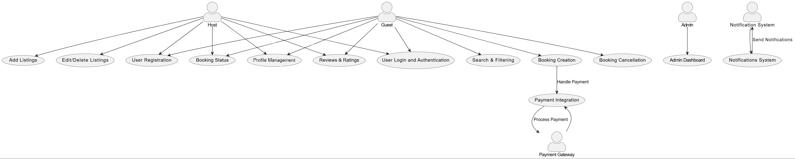

# Use Case Diagram for Airbnb Clone

This document outlines the use case diagram for the Airbnb Clone backend, visualizing the interactions between users and the system for key functionalities.

---

## Objective

The use case diagram illustrates how different users (actors) interact with the system to perform various functionalities, such as user registration, property booking, and payments.

---

## Actors in the System

1. **Guest**  
   - Users who search for properties, make bookings, and complete payments.

2. **Host**  
   - Users who create and manage property listings.

3. **Admin**  
   - System administrators who oversee user and property management.

4. **Payment Gateway**  
   - External service for secure payment processing.

---

## Key Use Cases

### **Guest**
   - Register/Login
   - Search for properties
   - Book a property
   - Make a payment
   - Cancel a booking

### **Host**
   - Register/Login
   - List a new property
   - Manage property listings (update/delete)
   - View booking details for their properties

### **Admin**
   - Manage users (Guests/Hosts)
   - Monitor property listings
   - Oversee bookings and payments
   - Generate system reports

### **Payment Gateway**
   - Process payments
   - Handle refunds for cancellations

---

## Use Case Diagram

The **PNG export** of the use case diagram is located in this directory as:

- **File Name**: `airbnb-clone-use-case-diagram.png`

---

## Diagram Preview

---

